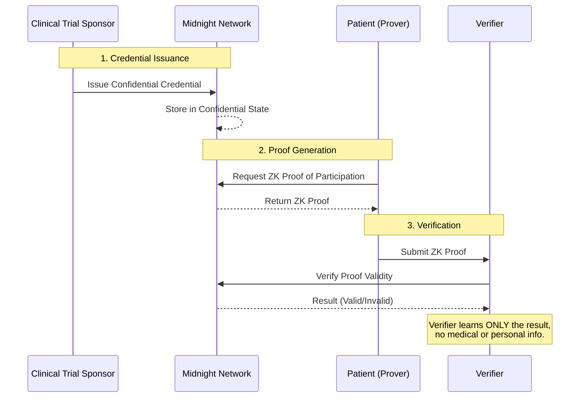

# Proof of Clinical Trial Participation (ZK-Participation)

A decentralized application (dApp) built on the **Midnight Network** that allows patients to prove they participated in a legitimate clinical trial using Zero-Knowledge Proofs (ZKPs)—without revealing any sensitive medical or personal information.

## 🚀 The Problem & Solution

Today, proving clinical trial participation requires sharing documents that expose your full identity, the hospital, the specific trial, and underlying medical conditions. The verifier learns far more information than necessary.

**Our Solution:** We issue every participant a confidential digital credential stored on Midnight. Using zero-knowledge proofs, patients can generate a cryptographic proof that states: *"I possess a valid clinical trial participation credential."* The verifier receives only `✓ Valid` or `✗ Invalid`. No confidential information is ever leaked.

## ✨ Features

- **Confidential Smart Contracts:** Written in Midnight's Compact language (`contracts/src/ClinicalTrialCredential.compact`).
- **Zero-Knowledge Proofs:** Patients prove credential ownership without exposing private variables (Identity, Trial Details, Issue Date, Completion Status).
- **Role-Based Dashboards:** A fully modularized React frontend with dedicated views for Sponsors, Patients, and Verifiers.
- **Zero-Config Demo Mode:** The frontend utilizes a custom `cipher-bridge.ts` to seamlessly simulate the ZK cryptographic workflows entirely in the browser using WebCrypto, making it perfect for rapid hackathon demonstrations without needing RPC nodes or private `.npmrc` authentication tokens.

## 🛠 Tech Stack

- **Frontend:** React, TypeScript, Tailwind CSS, Vite, Lucide Icons, Framer Motion
- **Blockchain:** Midnight Network, Compact Smart Contracts, `@midnight-ntwrk/compact-runtime`

## 📂 Project Structure

```text
ZK-Participation/
├── contracts/                              # Midnight Smart Contracts
│   ├── src/
│   │   ├── ClinicalTrialCredential.compact # Main ZK Circuit
│   │   ├── ClinicalTrialWitnesses.ts       # TS Witness implementations
│   │   └── cipher-bridge.ts                # Browser-safe cryptographic bridge
│   └── package.json
└── frontend/                               # React UI Application
    ├── src/app/
    │   ├── components/                     # UI & Layouts
    │   ├── pages/                          # Role-specific Dashboards
    │   ├── services/blockchain.ts          # Exports cipher-bridge for the UI
    │   └── App.tsx                         # Main Router
    └── package.json
```

## 💻 Quick Start

The project is currently configured to run in "Demo Mode", allowing it to run the entire end-to-end ZK workflow locally in your browser without needing an RPC node or private .npmrc authentication token.

### Prerequisites
- Node.js 18+

### 1. Run the Frontend
```bash
cd frontend
npm install
npm run dev
```
Open `http://localhost:5173` in your browser.

### 2. Demo Flow
1. **Sponsor**: Click "Sign In" as a Sponsor. Connect your wallet and issue a credential to a patient.
2. **Patient**: Log out, then "Sign In" as a Patient. View your new confidential credential and click **Generate Proof**. Copy the generated JSON proof.
3. **Verifier**: Log out, "Sign In" as a Verifier, paste the proof, and watch the system cryptographically verify it without revealing any sensitive information.

## 🔗 Smart Contract Compilation (Production Mode)

To compile the actual Compact smart contracts for network deployment, you must have the **Compact CLI** installed and an official Midnight `.npmrc` authentication token to pull the private packages.

```bash
cd contracts
npm install
compact compile src/ClinicalTrialCredential.compact ./managed
npm run typecheck
```

## 🏗 Architecture & Data Flow



