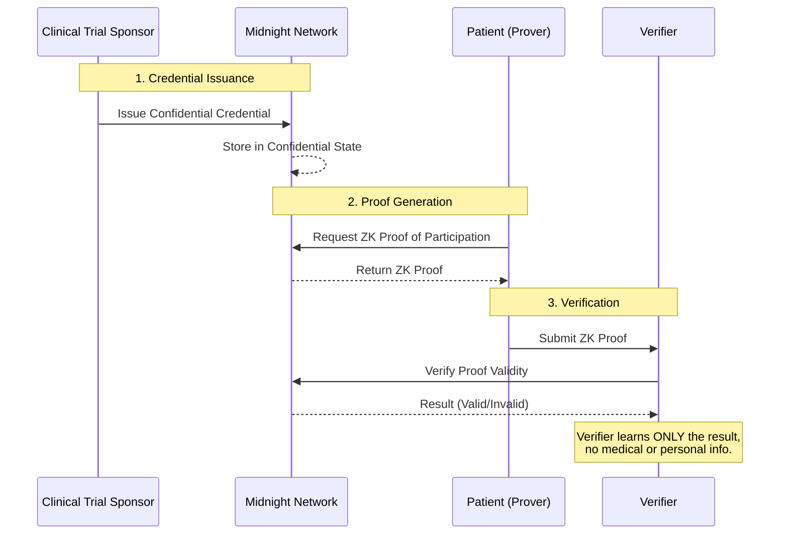

# Proof of Clinical Trial Participation

## Overview
We are building a decentralized application (dApp) on Midnight that allows a patient to prove they participated in a legitimate clinical trial without revealing any sensitive medical information.

Today, proving participation usually means sharing documents that expose personal information, such as the patient's identity, the hospital, the trial, or even medical conditions. Our application replaces this with a privacy-preserving digital credential.

Using Midnight's confidential smart contracts and zero-knowledge capabilities, a patient can prove that they possess a valid credential issued by an authorized clinical trial sponsor without revealing anything else.

The project is not intended to manage clinical trials or store medical records. It focuses on one problem: **Can someone prove they participated in a clinical trial without revealing any confidential information?**

## The Problem
Suppose Alice participates in a clinical trial for a new cancer treatment. Later, she wants to:
- Qualify for another research program
- Receive compensation
- Apply for an insurance benefit
- Prove eligibility for a follow-up study

Currently, she would likely have to share documents containing her full name, the hospital, the disease, the medication, trial identifiers, doctor's signatures, and medical reports. The verifier learns far more information than necessary.

Instead, the verifier only needs the answer to one question: *"Did this person legitimately participate in an approved clinical trial?"*

Our application allows the answer to be: **Yes, without revealing anything else.**

## Our Solution
We issue every participant a confidential digital credential stored on Midnight.
- That credential acts like a private certificate.
- Unlike a PDF certificate, nobody else can read it.
- Unlike a database record, nobody else can inspect it.
- Only the owner can generate proofs from it.

Whenever proof is required, the patient generates a cryptographic proof that states: *"I possess a valid clinical trial participation credential."*

The verifier receives only the proof. They never receive patient identity, hospital, trial name, diagnosis, medication, or treatment results.

## Users

### Clinical Trial Sponsor
**Examples:** Hospitals, Pharmaceutical companies, Research institutions.

**Responsibilities:**
- Register participants
- Issue participation credentials
- Revoke credentials if necessary

### Patient
**Responsibilities:**
- Connect wallet
- View credential
- Generate proof
- Share proof

*The patient always controls when proofs are generated.*

### Verifier
**Examples:** Insurance company, Research organization, University, Government agency, Employer (if appropriate).

**Responsibilities:**
- Receive proof
- Verify proof
- Learn only whether the proof is valid

## Credential Lifecycle

### 1. Credential Issuance
The sponsor selects a participant. Instead of storing medical information publicly, the contract creates a confidential credential. Conceptually it contains:
- Participant
- Issuer
- Trial identifier
- Completion status
- Issue date
- Revocation status

All of this remains confidential.

### 2. Storage
The credential lives inside Midnight's confidential state. Nobody browsing the blockchain can inspect it. This is the primary advantage over public blockchains.

### 3. Proof Generation
When the patient wants to prove participation, they connect their wallet and press "Generate Proof". The smart contract produces a proof that says: *This wallet owns a valid, non-revoked clinical trial participation credential.* Nothing else is disclosed.

### 4. Verification
The verifier submits the proof. The contract validates it. The verifier receives only `✓ Valid` or `✗ Invalid`. No confidential information is leaked.

## Why Midnight?
A traditional blockchain would expose every credential publicly. That defeats the purpose because medical information is highly sensitive. Midnight provides:
- Confidential smart contract state
- Private transactions
- Zero-knowledge proofs
- Selective disclosure

These features allow sensitive medical credentials to exist on-chain without becoming public.

## Architecture

## Core Features
- **Issue Credential**: Authorized organizations create a confidential credential for a participant.
- **Generate Proof**: Patients create a privacy-preserving proof from their credential.
- **Verify Proof**: Anyone can verify authenticity without learning confidential information.
- **Revoke Credential**: Sponsors can revoke credentials if required. Future proofs automatically fail.

## What We Are NOT Building
To keep the project achievable within a 30-hour hackathon, we are intentionally not building:
- Electronic medical records
- Clinical trial management
- Appointment scheduling
- Hospital systems
- Doctor dashboards
- Authentication systems
- Payment systems
- Prescription management
- File uploads
- Medical report storage

These are outside the scope of the core privacy problem.

## Technology Stack
- **Frontend**: React (or Next.js), Midnight Wallet integration
- **Blockchain**: Midnight confidential smart contracts
- **Deployment**: Static frontend hosting, Midnight network deployment

## Demo Flow
1. A sponsor connects their wallet and issues a confidential participation credential to a patient's wallet.
2. The patient connects their wallet and clicks **Generate Proof**.
3. The application produces a zero-knowledge proof that confirms they possess a valid credential.
4. A verifier submits the proof and receives "Valid".

Throughout the demo, no personal information, trial details, or medical records are ever revealed.
